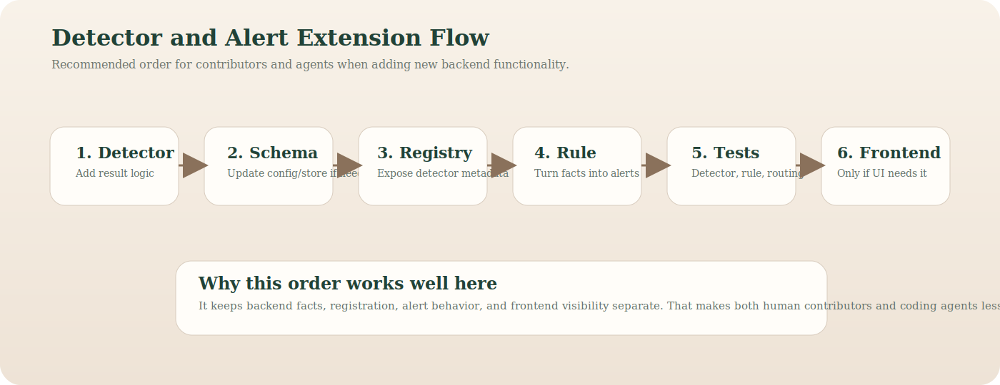

# Adding a Detector

This document explains the easiest safe way to add a new detector in the
current project.

Read first if needed:

- [architecture.md](./architecture.md)
- [data-models.md](./data-models.md)
- [adding-an-alert-rule.md](./adding-an-alert-rule.md)

The main idea is:

1. detector computes facts
2. registry exposes detector
3. rule layer decides whether to alert
4. frontend sees detector metadata through the existing bridge

## Before you start

A detector in this repo is not the same thing as an alert.

Keep this split:

- detector:
  - extracts metrics or conditions from one file / segment / image
- alert rule:
  - turns detector output into a user-facing alert if needed

That separation is already in the project and should stay.

## Step 1: implement detector logic

Add the detector in [`src/detectors.py`](../src/detectors.py) or move it into a dedicated detector module if it becomes large enough.

A detector should:

- accept one input file
- optionally accept light context like `prefix`
- return one flat result dict
- include shared metadata fields
- not write to stores directly
- not generate alerts directly

Shared metadata fields come from [`src/analyzer_contract.py`](../src/analyzer_contract.py).

## Step 2: decide the result shape

Prefer result rows that are:

- flat
- easy to serialize
- easy to test
- easy to reuse in alert rules

If the detector can use an existing schema family, reuse it.

If not:

- add or update schema columns in [`src/config.py`](../src/config.py)
- add or reuse the matching store in [`src/stores.py`](../src/stores.py)

## Step 3: register the detector

Add the detector in [`src/analyzer_registry.py`](../src/analyzer_registry.py).

Registration should define:

- detector id
- callable
- store target
- supported modes
- supported suffixes
- display name
- description
- category
- status
- whether it is selected by default
- whether it produces alerts

Keep registrations explicit.

## Step 4: add alert logic if needed

If the detector should produce alerts, update [`src/alert_rules.py`](../src/alert_rules.py).

Preferred rule style:

- keep the rule readable
- keep the rule cheap to compute
- use normalized values when possible
- if rolling state is needed, keep it inside the rule layer

Good current examples:

- black-screen rule
  - one immediate condition
  - one rolling-window condition
- blur rule
  - normalized blur score with rolling windows

## Step 5: think about supported modes honestly

Do not expose a detector in every mode by default.

Decide whether it really supports:

- `video_segments`
- `video_files`
- later `api_stream`

If a detector is likely to work later for API streams, that is fine, but do not pretend it is ready before the ingestion path exists.

## Step 6: make sure the frontend can use it

If registration metadata is correct, the detector should usually appear in the frontend automatically through the current bridge path.

You only need extra frontend work if:

- the detector needs custom UI wording
- the detector needs custom visualization
- the detector changes playback/session behavior

## Step 7: test it

At minimum, add:

- one detector unit test
- one alert rule test if alerts were added
- one registry or processor test if routing changed
- one session test if the detector affects rolling state or session behavior

## Best order for agents and contributors

If you are a coding agent or a human contributor, the safest order is:

1. detector output
2. schema/store update if needed
3. registry entry
4. alert rule
5. tests
6. optional frontend polish

That order fits this repo better than starting from the UI first.

## Things to avoid for now

Avoid:

- dynamic plugin loading
- abstract inheritance trees
- detector factories
- putting alert logic inside detectors
- mixing frontend behavior into backend detector code

The project currently benefits most from clear, explicit additions.
