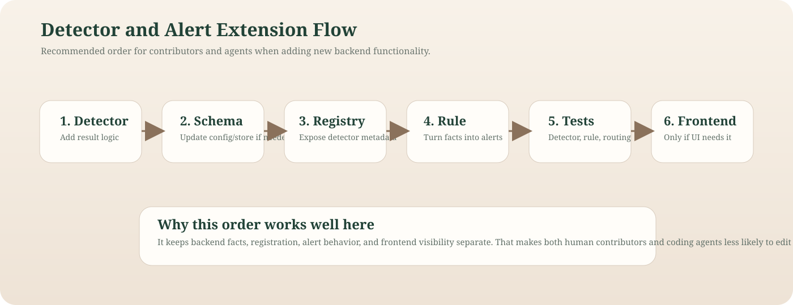

# Adding a Detector

This document explains the easiest safe way to add a new detector in the
current project.

Read first if needed:

- [architecture.md](./architecture.md)
- [data-models.md](./data-models.md)
- [adding-an-alert-rule.md](./adding-an-alert-rule.md)

The main idea is:

1. detector computes facts
2. registry exposes detector
3. processor normalizes detector output for the runtime
4. rule layer decides whether to alert
5. frontend sees detector metadata through the existing bridge

## Before you start

A detector in this repo is not the same thing as an alert.

Keep this split:

- detector:
  - extracts metrics or conditions from one file / segment / image
- alert rule:
  - turns detector output into a user-facing alert if needed

That separation is already in the project and should stay.

## Step 1: implement detector logic

Add the detector in the [`src/detectors/`](../src/detectors) package. Prefer
one focused module per production detector rather than growing one large file.

A detector should:

- accept one input file
- optionally accept light context like `prefix`
- return a stable typed row or detector-shaped mapping
- include shared metadata fields
- not write to stores directly
- not generate alerts directly

Shared metadata fields come from [`src/analyzer_contract.py`](../src/analyzer_contract.py).

## Step 2: decide the result shape

Prefer result rows that are:

- flat
- easy to serialize
- easy to test
- easy to reuse in alert rules

In the current runtime, the preferred direction is:

- typed detector rows in memory
- flat dictionaries only at the processor/storage/event boundary

If the detector can use an existing schema family, reuse it.

If not:

- add or update schema columns in [`src/config.py`](../src/config.py)
- add or reuse the matching store in [`src/stores.py`](../src/stores.py)

## Step 3: register the detector

Add the detector in [`src/detectors/registry.py`](../src/detectors/registry.py).

Registration should define:

- detector id
- callable
- store target
- supported modes
- supported suffixes
- display name
- description
- category
- status
- whether it is selected by default
- whether it produces alerts

Keep registrations explicit.
Treat [`src/detectors/registry.py`](../src/detectors/registry.py) as the
source of truth. The older
[`src/analyzer_registry.py`](../src/analyzer_registry.py) file remains only as
a compatibility shim for older imports.
Use [`../tests/test_analyzer_registry.py`](../tests/test_analyzer_registry.py)
when you need to confirm registry ownership or detector catalog expectations.

## Step 4: add alert logic if needed

If the detector should produce alerts, update [`src/alert_rules.py`](../src/alert_rules.py).

Preferred rule style:

- keep the rule readable
- keep the rule cheap to compute
- use normalized values when possible
- if rolling state is needed, keep it inside the rule layer

Good current examples:

- black-screen rule
  - one immediate condition
  - one rolling-window condition
- blur rule
  - normalized blur score with rolling windows
  - motion-aware entry suppression kept in the rule layer

## Optional step: try it in detector_lab first

If the detector idea is still exploratory, prefer proving it in
[`../detector_lab/README.md`](../detector_lab/README.md) before hardening it in
the production runtime.

That is especially useful when you are:

- tuning blur scoring
- comparing alternative metric blends
- checking behavior against the checked-in MP4 fixture sets
- validating whether detector changes actually improve alert output

Keep the maturity split explicit:

- `detector_lab/`
  - experiment workspace
  - acceptable place for competing algorithms, practical lab-only alerts, and
    motion-blur prototypes
- production runtime
  - only detectors registered in [`src/detectors/registry.py`](../src/detectors/registry.py)
  - only runtime alert policy registered in [`src/alert_rules.py`](../src/alert_rules.py)

Promotion from detector-lab into the runtime should be intentional, not
implicit.

Treat `detector_lab` as proof-of-comparison space, not as proof of production
support.

The promotion target today is not just “a detector function exists.” It means:

- detector wiring belongs in [`src/detectors/registry.py`](../src/detectors/registry.py)
- runtime row semantics fit the processor boundary
- runtime alert behavior is defined in [`src/alert_rules.py`](../src/alert_rules.py) if alerts are expected
- production-facing tests cover the supported runtime path
- runtime docs describe it as supported behavior

## Step 5: think about supported modes honestly

Do not expose a detector in every mode by default.

Decide whether it really supports:

- `video_segments`
- `video_files`
- later `api_stream`

If a detector is likely to work later for API streams, that is fine, but do not pretend it is ready before the ingestion path exists.

## Step 6: make sure the frontend can use it

If registration metadata is correct, the detector should usually appear in the frontend automatically through the current bridge path.

You only need extra frontend work if:

- the detector needs custom UI wording
- the detector needs custom visualization
- the detector changes playback/session behavior

## Step 7: test it

At minimum, add:

- one detector unit test
- one alert rule test if alerts were added
- one registry or processor test if routing changed
- one session test if the detector affects rolling state or session behavior

## Promotion checklist

Before treating a detector-lab idea as production runtime behavior, verify:

- detector row shape is stable and well named
- runtime ownership is clear in [`src/detectors/registry.py`](../src/detectors/registry.py)
- processor compatibility is understood and validated
- runtime alert policy, if needed, is defined in [`src/alert_rules.py`](../src/alert_rules.py)
- production-facing tests cover the detector and any runtime alert behavior
- session, processor, and persistence impact are understood
- runtime docs are updated alongside detector-lab docs

Do not rely on detector-lab documentation alone to imply runtime support.

## Best order for agents and contributors

If you are a coding agent or a human contributor, the safest order is:

1. detector output
2. schema/store update if needed
3. registry entry
4. alert rule
5. tests
6. optional frontend polish

That order fits this repo better than starting from the UI first.

Treat `src/analyzer_contract.py` and `src/detectors/registry.py` as the first
places to verify before editing detector wiring. They are the most common
source-of-truth files that agents and contributors accidentally bypass.

## Safe Edit Checklist

When adding or changing a detector, review these together:

- `src/analyzer_contract.py`
- `src/detectors/registry.py`
- the detector implementation file
- alert-rule registration if alerts are expected
- frontend detector catalog assumptions
- backend tests for detector output
- any frontend or contract docs that describe detector catalog behavior

In practice, this usually means:

1. define or update the detector result shape
2. register the detector explicitly
3. confirm the detector catalog still makes sense to the frontend
4. add or update alert-rule behavior if the detector should emit warnings
5. add tests before treating the detector as stable

This keeps detector logic, registration, alert behavior, and UI visibility from
drifting apart.

## Things to avoid for now

Avoid:

- dynamic plugin loading
- abstract inheritance trees
- detector factories
- putting alert logic inside detectors
- mixing frontend behavior into backend detector code

The project currently benefits most from clear, explicit additions.
