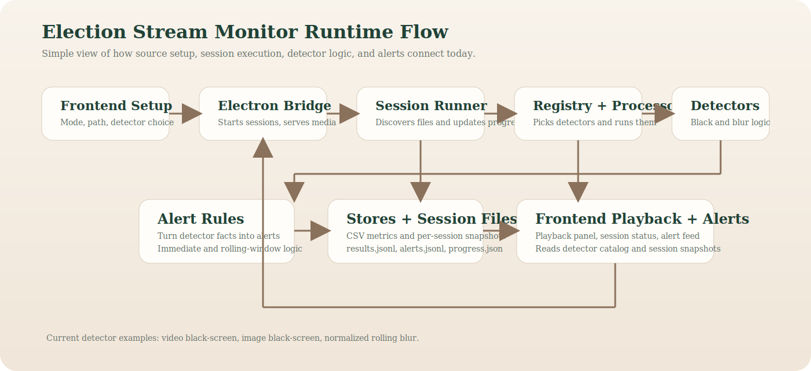
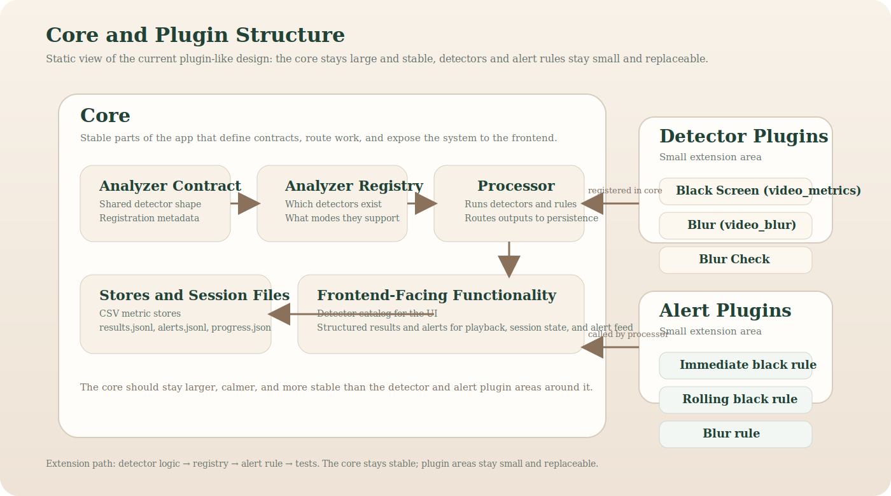

# Architecture

This document describes the current runtime architecture of Election Stream Monitor.

It is written for contributors and people using AI-assisted tools for coding
and development who need to reason about the actual code paths in the
repository today, not the aspirational future design.

Use this doc for responsibilities and change placement.
Do not use it as the source of truth for field-level payloads or exact
persisted-session semantics; see [contracts.md](./contracts.md) and
[session-model.md](./session-model.md) for those.

## At a glance

- project stage: advanced prototype / pre-pilot
- architecture shape: local-first modular monolith
- backend: Python session runner, detectors, alert rules, persistence
- frontend: React/Electron setup, playback, alert inspection
- live support: direct `.m3u8` / `.mp4` `api_stream` inputs with backend
  loading and Electron-side HLS playback proxying

## Best use of this doc

Use this document when you need to answer:

- where a responsibility lives
- which layer should change for a given feature or bug
- whether something belongs to transport, session lifecycle, detector logic,
  alert policy, playback, or persistence

## Short version

The project is a local-first modular monolith with explicit detector
registration and file-backed session state.

In practice that means:

- one Python backend
- one React/Electron frontend
- explicit detector registration
- explicit alert rules
- no dynamic plugin discovery yet
- explicit bridge contract normalization between Electron and React
- pre-loader security rules for future plugin manifests

The active flow is no longer just `input -> analyzer -> CSV`.

It is now:

`source -> session -> detector execution -> alert rules -> persistence -> frontend polling`

## Main runtime flow

1. The frontend chooses:
   - source mode
   - source path
   - selected detectors
2. The React app calls the normalized bridge surface exposed through
   `window.electionBridge`.
3. Electron owns local runtime startup/readiness, talks to the local FastAPI
   backend for normal operation, and returns explicit success/error envelopes
   to the frontend transport layer.
4. [`src/session_runner.py`](../src/session_runner.py) resolves files or slices for the chosen mode.
5. [`src/analyzer_registry.py`](../src/analyzer_registry.py) decides which detectors are enabled for that mode.
6. [`src/detectors.py`](../src/detectors.py) produces flat result rows.
7. [`src/alert_rules.py`](../src/alert_rules.py) decides whether those result rows should create alerts.
8. Session files are written under `data/sessions/`.
9. The frontend polls the session snapshot and updates playback and alerts.

## Input modes

Current modes:

- `video_segments`
- `video_files`
- `api_stream`

These modes describe how the source arrives, not what the detector does.

Right now the behavior is:

- `video_segments`
  - preferred near-live path
  - `.ts` files are processed one by one
- `video_files`
  - `.mp4` inputs are expanded into roughly one-second analysis slices
  - this keeps detector and alert timing aligned with segment-style processing
  - image files are processed one by one
- `api_stream`
  - accepts direct `.m3u8` or `.mp4` URLs
  - backend loader owns live playlist polling, segment download, reconnect
    behavior, and temp-file lifecycle
  - Electron playback uses a local HLS proxy for remote HLS sources when the
    renderer would otherwise hit CORS limits

## Core backend modules

### Detector contract

[`src/analyzer_contract.py`](../src/analyzer_contract.py)

Defines:

- analyzer result base shape
- analyzer callable contract
- registration metadata
- analysis slice metadata
- future plugin manifest validation contract

This is the stable contract other layers rely on.

### Detector registry

[`src/analyzer_registry.py`](../src/analyzer_registry.py)

The registry defines:

- detector id
- callable
- supported modes
- supported suffixes
- output store
- frontend-facing metadata
- default bundled alert-rule linkage
- explicit detector ownership (`built_in` vs `user`)

This is the main extension point for new detectors.

### Detector implementation

[`src/detectors.py`](../src/detectors.py)

Detectors are expected to:

- process one file or one time slice
- return a flat result dict
- avoid direct persistence
- avoid frontend concerns

Current examples:

- video black-screen metrics
- image black-screen metrics
- normalized rolling blur metrics

### Alert rules

[`src/alert_rules.py`](../src/alert_rules.py)

This layer converts detector output into alert events.

That separation is intentional:

- detectors compute facts
- rules decide whether those facts matter enough to alert

Some rules are stateless.
Some rules keep small session-local rolling state, like the current black and
blur rules. That state is reset at session boundaries by the runner.

### Processor

[`src/processor.py`](../src/processor.py)

Responsibilities:

- retrieve enabled detectors from the registry
- run matching detectors
- write results to the correct store
- evaluate alert rules
- isolate detector failures where possible
- treat persistence failures as session-fatal

### Session runner

[`src/session_runner.py`](../src/session_runner.py)

Responsibilities:

- create and update session state
- discover inputs for the chosen mode
- run the processor item by item
- persist progress, results, and alerts
- reset rolling rule state at session boundaries
- enforce the current source validation and local media trust limits
- route `api_stream` through the dedicated loader seam instead of treating it
  like local file discovery

### Session persistence

[`src/session_io.py`](../src/session_io.py)

Responsibilities:

- initialize session files
- append results and alerts
- write progress safely
- read session snapshots

The current design uses local files as the persisted session contract between
backend and frontend, but snapshot assembly is explicit and defensive against
missing or malformed artifacts.

### Stores

[`src/stores.py`](../src/stores.py)

Persistence is still simple:

- CSV-backed buffered stores
- one store instance per result schema family

These are stores for detector result metrics, not stores for alerts.

## Frontend/backend boundary

The frontend is local-first and talks to Python through Electron.

Important parts:

- [`frontend/electron/main.mjs`](../frontend/electron/main.mjs)
  - thin Electron composition/wiring entrypoint
  - owns high-level bootstrap order, bridge registration, and app lifecycle hooks
  - delegates FastAPI startup/readiness and playback transport details to focused helpers
  - local media serving and remote HLS proxying for playback
- [`frontend/src/hooks/useSetupState.ts`](../frontend/src/hooks/useSetupState.ts)
  - setup state
- [`frontend/src/hooks/useMonitoringSession.ts`](../frontend/src/hooks/useMonitoringSession.ts)
  - session lifecycle
- [`frontend/src/hooks/usePlaybackSource.ts`](../frontend/src/hooks/usePlaybackSource.ts)
  - playback source and playback state
- [`frontend/src/bridge/contract.ts`](../frontend/src/bridge/contract.ts)
  - explicit bridge envelopes
  - normalization and typed transport errors
- [`frontend/src/bridge/transport.ts`](../frontend/src/bridge/transport.ts)
  - one swappable transport surface for Electron or demo mode

This split is important because playback state and backend session state are related, but not the same thing.

## Where to change things

If you are deciding where a change belongs:

- detector math / extracted metrics
  - `src/detectors.py`
- alert thresholds / re-alert semantics / operator wording from detector output
  - `src/alert_rules.py`
- session lifecycle / completion / cancel / failure behavior
  - `src/session_runner.py`
- `api_stream` transport, reconnect, playlist parsing, temp files
  - `src/stream_loader.py`
- renderer playback routing and HLS proxy behavior
  - `frontend/electron/main.mjs`
  - `frontend/electron/hlsProxy.mjs`
  - `frontend/src/components/VideoPlayerPanel.tsx`

## Current design decisions

The project currently prefers:

- explicit detector registration over dynamic plugin loading
- readable rule definitions over hidden heuristics
- flat result rows over deeply nested payloads
- simple local persistence over service infrastructure
- composition over heavy OOP
- explicit trust-boundary validation over permissive source handling
- one explicit preload bridge surface over ad-hoc renderer capabilities

## Good next architectural moves

Most useful next steps:

- add more detectors through the current registry pattern
- keep detector output and alert rules separate
- make rule thresholds easier to tune
- keep hardening `api_stream` without rewriting the current contracts
- keep transport swappable without changing the bridge meaning

Dynamic plugin loading should stay postponed until detector count actually makes it necessary.

## Failure policy

The current `api_stream` runtime intentionally distinguishes four operator-level
outcomes:

- `retry`
  - transient upstream or polling failure where the loader should keep going
- `stop`
  - bounded or graceful terminal state such as `ENDLIST` or idle-poll stop
- `fail`
  - explicit terminal runtime failure such as reconnect-budget exhaustion,
    runtime-limit exhaustion, malformed unsupported source, or temp-budget
    exhaustion
- `cancel`
  - explicit user-requested shutdown

The important design choice is that low-level transport errors stay inside the
loader seam, while session persistence and frontend wording consume a smaller,
stable set of outcomes.

That keeps three layers aligned:

- backend logs keep detailed failure reasons
- persisted progress snapshots keep machine-readable `status_reason` and
  `status_detail`
- frontend UI maps those details to operator-safe wording without exposing raw
  transport noise

## FastAPI boundary

A first FastAPI boundary now exists for the stable backend/session contract.

It currently provides:

- `GET /health`
- `GET /detectors`
- `POST /sessions`
- `GET /sessions/{session_id}`
- `POST /sessions/{session_id}/cancel`
- `POST /playback/resolve`

The current FastAPI layer is the normal runtime backend boundary for the
desktop app. Electron now owns local FastAPI startup/readiness and uses the
API for normal session and playback-resolution bridge operations.

The Python CLI remains available as a tooling/debugging seam rather than the
normal runtime bridge.

Use these docs together:

- [fastapi-boundary.md](./fastapi-boundary.md)
  - practical run/use/current-status guide
- [architecture-decision-fastapi.md](./architecture-decision-fastapi.md)
  - ownership split and migration order

Current ownership split:

- FastAPI owns:
  - stable monitoring/session backend behavior
  - structured API error payloads
  - session snapshot reads
  - validated playback-resolution contract
- local/runtime-specific layers keep owning:
  - Electron-only `local-media://` serving
  - remote HLS proxying for renderer playback
  - local file trust rules
  - FFmpeg/FFprobe invocation
  - temp-file materialization and cleanup
  - local process-spawn details for detached session execution and backend
    startup

That split is intentional because FastAPI should expose the stable monitoring
contract, not absorb every desktop/runtime concern that currently exists only
to support the local Electron app.

If you change FastAPI request/response semantics, review these together:

- `src/api/schemas.py`
- `frontend/src/bridge/contract.ts`
- `frontend/src/types.ts`
- `docs/contracts.md`
- `tests/test_api_boundary.py`
- `frontend/src/bridge/contract.test.ts`
