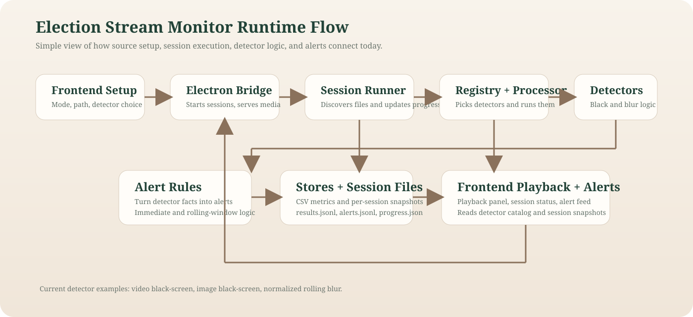
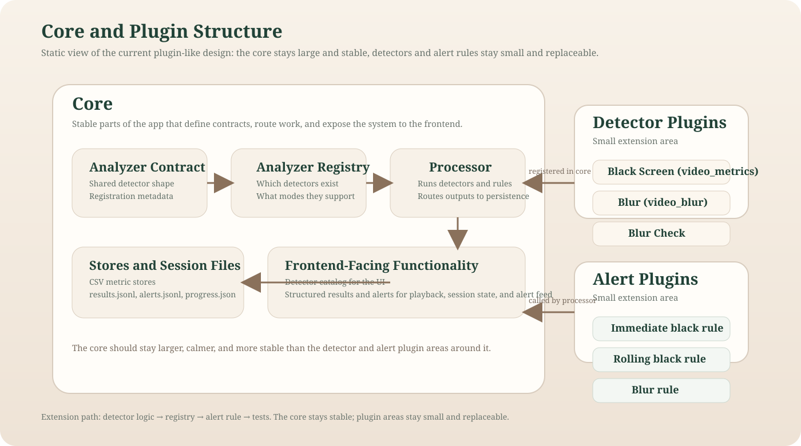

# Architecture

This document describes the current runtime architecture of Election Stream Monitor.

It is written for contributors and people using AI-assisted tools for coding
and development who need to reason about the actual code paths in the
repository today, not the aspirational future design.

Use this doc for responsibilities and change placement.
Do not use it as the source of truth for field-level payloads or exact
persisted-session semantics; see [contracts.md](./contracts.md) and
[session-model.md](./session-model.md) for those.

## At a glance

- project stage: advanced prototype / pre-pilot
- architecture shape: local-first modular monolith
- backend: Python session runner, detectors, alert rules, persistence
- frontend: React/Electron setup, playback, alert inspection
- live support: direct `.m3u8` / `.mp4` `api_stream` inputs with backend
  loading and Electron-side HLS playback proxying

## Best use of this doc

Use this document when you need to answer:

- where a responsibility lives
- which layer should change for a given feature or bug
- whether something belongs to transport, session lifecycle, detector logic,
  alert policy, playback, or persistence

## Short version

The project is a local-first modular monolith with explicit detector
registration, file-backed session state, and opt-in PostgreSQL alert storage
for alerts.

In practice that means:

- one Python backend
- one React/Electron frontend
- explicit detector registration
- explicit alert rules
- no dynamic plugin discovery yet
- explicit bridge contract normalization between Electron and React
- pre-loader security rules for future plugin manifests

The active flow is no longer just `input -> analyzer -> CSV`.

It is now:

`source -> session -> detector execution -> alert rules -> persistence -> frontend polling`

## Main runtime flow

1. The frontend chooses:
   - source mode
   - source path
   - selected detectors
2. The React app calls the normalized bridge surface exposed through
   `window.electionBridge`.
3. Electron owns local runtime startup/readiness, talks to the local FastAPI
   backend for normal operation, and returns explicit success/error envelopes
   to the frontend transport layer.
4. [`src/api/routers/sessions.py`](../src/api/routers/sessions.py) adapts HTTP session requests into the shared application service in [`src/session_service.py`](../src/session_service.py).
5. [`src/session_runner.py`](../src/session_runner.py) coordinates the actual monitoring run and delegates local discovery/progress shaping to its focused helper modules.
6. [`src/analyzer_registry.py`](../src/analyzer_registry.py) decides which detectors are enabled for that mode.
7. [`src/detectors.py`](../src/detectors.py) produces flat result rows.
8. [`src/alert_rules.py`](../src/alert_rules.py) decides whether those result rows should create alerts.
9. Session files are written under `data/sessions/`, including backend-owned
   diagnostic artifacts such as `worker.log`.
10. The frontend polls the session snapshot and updates playback and alerts.

The new MCP surface follows the same adapter pattern:

- [`src/esm_mcp/server.py`](../src/esm_mcp/server.py) is a read-only MCP adapter
- [`src/session_alert_store.py`](../src/session_alert_store.py) defines the
  narrow alert persistence interface and now owns the centralized runtime
  default store selection
- [`src/session_alert_store_runtime_config.py`](../src/session_alert_store_runtime_config.py)
  owns the explicit `file` versus `postgres` backend-mode selection for that
  default store through `ESM_ALERT_STORE_BACKEND`
- [`src/session_alert_store_postgres.py`](../src/session_alert_store_postgres.py)
  now freezes the PostgreSQL alert-table contract, owns the small
  connection/bootstrap path, and includes the concrete
  `PostgresSessionAlertStore` second backend over the existing seam
- [`src/session_alert_store_postgres_config.py`](../src/session_alert_store_postgres_config.py)
  owns the narrow Postgres alert-store env/config parsing used by that bootstrap path
- [`src/session_io.py`](../src/session_io.py) still exposes
  `append_alert(...)` as the compatibility write entrypoint and now delegates
  that write through the store interface
- [`src/session_alert_adapter.py`](../src/session_alert_adapter.py) keeps the
  small shared adapter mechanics reused by FastAPI and MCP
- [`src/session_alerts.py`](../src/session_alerts.py) owns persisted raw alert
  query/filter/summary logic and applies those read models over the store
  interface
- [`src/session_alert_incidents.py`](../src/session_alert_incidents.py) owns
  grouped incident timeline and incident-summary read models built on the raw
  alert service rather than the storage layer directly
- MCP tools call the shared service directly rather than routing through HTTP

The alert-query slice now has one explicit persistence interface and three read
models over it:

- raw alert-event list
- raw numeric alert summary
- grouped incident timeline and grouped incident summary

Today that means:

- `src/session_io.py::append_alert(...)` is still the compatibility write
  entrypoint
- the default alert backend is selected centrally in
  `src/session_alert_store.py`
- raw alert readers, grouped incident readers, the session snapshot route, and
  the CLI all follow that same shared alert backend
- filtering, summaries, and grouped incident logic still stay in Python above
  the storage layer

That split kept the current JSONL behavior intact while making the PostgreSQL
alert store a bounded replacement instead of a larger read-model rewrite.
PostgreSQL can now be selected explicitly at runtime, while file-backed alerts
remain the tested default backend for this branch.

The current PostgreSQL alert mapping is intentionally column-first rather than
JSONB-first:

- every current `AlertEventPayload` field maps to its own table column
- `window_index` and `window_start_sec` stay nullable
- append-order reads are preserved through `ORDER BY id ASC`
- filtering and summary behavior still stay above the storage interface

The first FastAPI authentication split follows the same boundary-oriented style:

- [`src/api_auth.py`](../src/api_auth.py) owns request-authentication mechanics
  for the HTTP API boundary
- [`src/api/alert_route_policy.py`](../src/api/alert_route_policy.py) owns the
  alerts-router HTTP protection policy that composes authentication and rate
  limiting
- [`src/config.py`](../src/config.py) owns the small structured auth settings
  object used by that boundary
- [`src/config.py`](../src/config.py) also owns the first structured
  rate-limit settings layer so later request counting can stay out of route
  bodies
- [`src/api_rate_limit.py`](../src/api_rate_limit.py) owns the current
  principal-aware fixed-window limiter and keeps its local in-memory store
  replaceable
- the alerts router currently applies both pieces through a router dependency
  instead of a global app-wide middleware
- the current `429` rate-limit error vocabulary is defined and enforced at the
  same API boundary
- shared application services remain auth-agnostic

Current MCP versus FastAPI trust boundary:

- the alerts-router FastAPI auth and rate limiting are HTTP-boundary concerns
- the current MCP server remains a local `stdio` adapter, not a remote
  authenticated service
- that separation is intentional: today's FastAPI protection work should stay
  reusable later without pretending it already secures MCP
- if MCP later moves to a remote transport, the project should reuse:
  - auth-neutral principal identity
  - the same general structured error vocabulary
  - maybe the limiter concepts or backend
- but that future work should still be implemented as MCP-boundary logic, not
  by coupling MCP directly to FastAPI dependencies

## Legacy Tooling

[`src/main.py`](../src/main.py) is a legacy local developer harness for the
older file-based path only.

- It is non-canonical and not part of the supported session/runtime
  architecture described above.
- It is kept temporarily for narrow local debugging/smoke use.
- It is slated for removal once the accepted replacement is focused pytest
  coverage for the older local-file path.

## Input modes

Current modes:

- `video_segments`
- `video_files`
- `api_stream`

These modes describe how the source arrives, not what the detector does.

Right now the behavior is:

- `video_segments`
  - preferred near-live path
  - `.ts` files are processed one by one
- `video_files`
  - `.mp4` inputs are expanded into roughly one-second analysis slices
  - this keeps detector and alert timing aligned with segment-style processing
  - image files are processed one by one
- `api_stream`
  - accepts direct `.m3u8` or `.mp4` URLs
  - backend loader owns live playlist polling, segment download, reconnect
    behavior, and temp-file lifecycle
  - Electron playback uses a local HLS proxy for remote HLS sources when the
    renderer would otherwise hit CORS limits

## Core backend modules

### Detector contract

[`src/analyzer_contract.py`](../src/analyzer_contract.py)

Defines:

- analyzer result base shape
- analyzer callable contract
- registration metadata
- analysis slice metadata
- future plugin manifest validation contract

This is the stable contract other layers rely on.

### Detector registry

[`src/analyzer_registry.py`](../src/analyzer_registry.py)

The registry defines:

- detector id
- callable
- supported modes
- supported suffixes
- output store
- frontend-facing metadata
- default bundled alert-rule linkage
- explicit detector ownership (`built_in` vs `user`)

This is the main extension point for new detectors.

### Detector implementation

[`src/detectors.py`](../src/detectors.py)

Detectors are expected to:

- process one file or one time slice
- return a flat result dict
- avoid direct persistence
- avoid frontend concerns

Current examples:

- video black-screen metrics
- image black-screen metrics
- normalized rolling blur metrics

### Alert rules

[`src/alert_rules.py`](../src/alert_rules.py)

This layer converts detector output into alert events.

That separation is intentional:

- detectors compute facts
- rules decide whether those facts matter enough to alert

Some rules are stateless.
Some rules keep small session-local rolling state, like the current black and
blur rules. That state is reset at session boundaries by the runner.

### Processor

[`src/processor.py`](../src/processor.py)

Responsibilities:

- retrieve enabled detectors from the registry
- run matching detectors
- write results to the correct store
- evaluate alert rules
- isolate detector failures where possible
- treat persistence failures as session-fatal

### Session runner

[`src/session_runner.py`](../src/session_runner.py),
[`src/session_runner_lifecycle.py`](../src/session_runner_lifecycle.py),
[`src/session_runner_execution.py`](../src/session_runner_execution.py),
[`src/session_runner_terminal.py`](../src/session_runner_terminal.py),
[`src/session_runner_discovery.py`](../src/session_runner_discovery.py),
[`src/session_runner_progress.py`](../src/session_runner_progress.py)

Responsibilities:

- keep `src/session_runner.py` as the orchestration layer:
  - validate the source
  - choose local vs `api_stream` execution
  - coordinate helper modules
  - reset rule state and perform final runtime cleanup
- keep pending-session setup and pending-to-running transitions in
  `src/session_runner_lifecycle.py`
- keep finite local-loop execution, live `api_stream` execution, analyzer-bundle
  invocation, and bundle-event persistence in
  `src/session_runner_execution.py`
- keep terminal outcome persistence, api-stream cleanup accounting, and
  operator-facing terminal logging in `src/session_runner_terminal.py`
- keep local file discovery, playlist expansion, and video-file slice
  expansion in `src/session_runner_discovery.py`
- keep progress/status shaping and operator-facing terminal log context in
  `src/session_runner_progress.py`
- persist progress, results, and alerts incrementally while resetting rolling
  rule state at session boundaries
- route `api_stream` through the dedicated loader seam instead of treating it
  like local file discovery

### Session service

[`src/session_service.py`](../src/session_service.py),
[`src/api/routers/sessions.py`](../src/api/routers/sessions.py),
[`src/session_cli.py`](../src/session_cli.py)

Responsibilities:

- keep `src/session_service.py` as the shared start/read/cancel application seam
- keep detached worker diagnostics session-scoped under
  `data/sessions/<session_id>/worker.log` without making them a frontend/API
  contract yet
- keep `src/api/routers/sessions.py` as the FastAPI adapter for the canonical desktop runtime path
- keep `src/session_cli.py` as the tooling/debugging adapter over the same shared service
- keep `run-session` in `src/session_cli.py` as the internal worker command used by the detached session process

Reading order for this module family:

1. `src/session_service.py`
2. `src/api/routers/sessions.py`
3. `src/session_cli.py`

That order is the shortest path for understanding where session lifecycle
request ownership ends and actual session execution begins.

Reading order for this module family:

1. `src/session_runner.py`
2. `src/session_runner_lifecycle.py`
3. `src/session_runner_execution.py`
4. `src/session_runner_terminal.py`
5. `src/session_runner_discovery.py`
6. `src/session_runner_progress.py`

That order mirrors the current ownership split and is the shortest path for a
mid-to-senior contributor who wants to follow one session from start to finish.

### API stream loader

[`src/stream_loader.py`](../src/stream_loader.py),
[`src/stream_loader_contracts.py`](../src/stream_loader_contracts.py),
[`src/stream_loader_http_hls.py`](../src/stream_loader_http_hls.py),
[`src/stream_loader_fakes.py`](../src/stream_loader_fakes.py)

Responsibilities:

- keep the stable, intentionally thin public `api_stream` facade and
  loader-selection entry point
- define the shared source/start/playback contract builders and identity helpers
- keep `src/stream_loader_http_hls.py` as the orchestration shell and runtime-state owner
- keep `src/stream_loader_http_hls_playlist.py` for playlist-kind detection and HLS playlist parsing helpers
- keep `src/stream_loader_http_hls_fetch.py` for request building, bounded response reads, and transport-failure mapping
- keep `src/stream_loader_http_hls_materialize.py` for temp-file writes and temp-storage byte accounting
- keep `src/stream_loader_http_hls_policy.py` for dedup/replay/window-gap helpers that operate on loader state
- keep deterministic seam loaders separate from the concrete HTTP/HLS transport

This keeps live transport behavior explicit and separate from session
orchestration in the runner.

### Session persistence

[`src/session_io.py`](../src/session_io.py)

Responsibilities:

- initialize session files
- append results and alerts
- write progress safely
- read session snapshots

The current design uses local files as the persisted session contract between
backend and frontend, but snapshot assembly is explicit and defensive against
missing or malformed artifacts.

### Stores

[`src/stores.py`](../src/stores.py)

Persistence is still simple:

- CSV-backed buffered stores
- one store instance per result schema family

These are stores for detector result metrics, not stores for alerts.

## Frontend/backend boundary

The frontend is local-first and talks to Python through Electron.

Important parts:

- [`frontend/electron/main.mjs`](../frontend/electron/main.mjs)
  - thin Electron composition/wiring entrypoint
  - owns high-level bootstrap order and app lifecycle hooks
  - delegates FastAPI startup/readiness and playback transport details to focused helpers
  - local media serving and remote HLS proxying for playback
- [`frontend/electron/fastApiStartupOrchestrator.mjs`](../frontend/electron/fastApiStartupOrchestrator.mjs)
  - composes backend process startup, readiness polling, and runtime policy
- [`frontend/electron/fastApiProcessManager.mjs`](../frontend/electron/fastApiProcessManager.mjs)
  - owns FastAPI process spawning, single-start behavior, and shutdown/reset
- [`frontend/electron/fastApiRuntimePolicy.mjs`](../frontend/electron/fastApiRuntimePolicy.mjs)
  - owns timeout, readiness, and unavailable-runtime policy decisions
- [`frontend/electron/fastApiFallback.mjs`](../frontend/electron/fastApiFallback.mjs)
  - keeps the older fallback seam explicit for unavailable-runtime scenarios
- [`frontend/electron/bridgeHandlerRegistry.mjs`](../frontend/electron/bridgeHandlerRegistry.mjs)
  - current IPC channel map and shared runtime-policy/error-envelope wiring
- [`frontend/electron/bridgeResponses.mjs`](../frontend/electron/bridgeResponses.mjs)
  - maps FastAPI/runtime failures into stable Electron bridge envelopes
- [`frontend/electron/fastApiClient.mjs`](../frontend/electron/fastApiClient.mjs)
  - thin JSON client for FastAPI bridge calls
- [`frontend/electron/playbackSourcePolicy.mjs`](../frontend/electron/playbackSourcePolicy.mjs)
  - renderer-safe playback URL adaptation
- [`frontend/electron/localMediaRequestPolicy.mjs`](../frontend/electron/localMediaRequestPolicy.mjs)
  - classifies `local-media://` requests before handing them to concrete responders
- [`frontend/electron/localMediaResponses.mjs`](../frontend/electron/localMediaResponses.mjs)
  - concrete local-media file/range responses and remote HLS proxy responses
  - kept separate from `localMediaRequestPolicy.mjs`, which classifies requests
    before response generation
- [`frontend/src/hooks/useSetupState.ts`](../frontend/src/hooks/useSetupState.ts)
  - setup state
- [`frontend/src/hooks/useMonitoringSession.ts`](../frontend/src/hooks/useMonitoringSession.ts)
  - session lifecycle
- [`frontend/src/hooks/usePlaybackSource.ts`](../frontend/src/hooks/usePlaybackSource.ts)
  - playback source and playback state
- [`frontend/src/bridge/contract.ts`](../frontend/src/bridge/contract.ts)
  - stable public bridge-normalization entrypoint
- [`frontend/src/bridge/contractErrors.ts`](../frontend/src/bridge/contractErrors.ts)
  - explicit bridge envelopes and typed transport errors
- [`frontend/src/bridge/contractDetectors.ts`](../frontend/src/bridge/contractDetectors.ts)
  - detector catalog normalization
- [`frontend/src/bridge/contractSessionSnapshot.ts`](../frontend/src/bridge/contractSessionSnapshot.ts)
  - session snapshot normalization
- [`frontend/src/bridge/transport.ts`](../frontend/src/bridge/transport.ts)
  - transport selection and demo fallback before normalization

This split is important because playback state and backend session state are related, but not the same thing.

## Where to change things

If you are deciding where a change belongs:

- detector math / extracted metrics
  - `src/detectors.py`
- alert thresholds / re-alert semantics / operator wording from detector output
  - `src/alert_rules.py`
- session lifecycle / completion / cancel / failure behavior
  - `src/session_runner.py`
  - `src/session_runner_discovery.py`
  - `src/session_runner_progress.py`
- `api_stream` transport, reconnect, playlist parsing, temp files
  - `src/stream_loader.py`
  - `src/stream_loader_contracts.py`
  - `src/stream_loader_http_hls.py`
  - `src/stream_loader_http_hls_playlist.py`
  - `src/stream_loader_http_hls_fetch.py`
  - `src/stream_loader_http_hls_materialize.py`
  - `src/stream_loader_http_hls_policy.py`
  - `src/stream_loader_fakes.py`
- renderer playback routing and HLS proxy behavior
  - `frontend/electron/main.mjs`
  - `frontend/electron/fastApiStartupOrchestrator.mjs`
  - `frontend/electron/fastApiRuntimePolicy.mjs`
  - `frontend/electron/fastApiProcessManager.mjs`
  - `frontend/electron/bridgeResponses.mjs`
  - `frontend/electron/hlsProxy.mjs`
  - `frontend/src/components/VideoPlayerPanel.tsx`

## Current design decisions

The project currently prefers:

- explicit detector registration over dynamic plugin loading
- readable rule definitions over hidden heuristics
- flat result rows over deeply nested payloads
- simple local persistence over service infrastructure
- composition over heavy OOP
- explicit trust-boundary validation over permissive source handling
- one explicit preload bridge surface over ad-hoc renderer capabilities

## Good next architectural moves

Most useful next steps:

- add more detectors through the current registry pattern
- keep detector output and alert rules separate
- make rule thresholds easier to tune
- keep hardening `api_stream` without rewriting the current contracts
- keep transport swappable without changing the bridge meaning

Dynamic plugin loading should stay postponed until detector count actually makes it necessary.

## Failure policy

The current `api_stream` runtime intentionally distinguishes four operator-level
outcomes:

- `retry`
  - transient upstream or polling failure where the loader should keep going
- `stop`
  - bounded or graceful terminal state such as `ENDLIST` or idle-poll stop
- `fail`
  - explicit terminal runtime failure such as reconnect-budget exhaustion,
    runtime-limit exhaustion, malformed unsupported source, or temp-budget
    exhaustion
- `cancel`
  - explicit user-requested shutdown

The important design choice is that low-level transport errors stay inside the
loader seam, while session persistence and frontend wording consume a smaller,
stable set of outcomes.

That keeps three layers aligned:

- backend logs keep detailed failure reasons
- persisted progress snapshots keep machine-readable `status_reason` and
  `status_detail`
- frontend UI maps those details to operator-safe wording without exposing raw
  transport noise

## FastAPI boundary

A first FastAPI boundary now exists for the stable backend/session contract.

It currently provides:

- `GET /health`
- `GET /detectors`
- `POST /sessions`
- `GET /sessions/{session_id}`
- `POST /sessions/{session_id}/cancel`
- `POST /playback/resolve`

The current FastAPI layer is the normal runtime backend boundary for the
desktop app. Electron now owns local FastAPI startup/readiness and uses the
API for normal session and playback-resolution bridge operations.

The Python CLI remains available as a tooling/debugging seam rather than the
normal runtime bridge.

Use these docs together:

- [fastapi-boundary.md](./fastapi-boundary.md)
  - practical run/use/current-status guide
- [architecture-decision-fastapi.md](./architecture-decision-fastapi.md)
  - ownership split and migration order

Current ownership split:

- FastAPI owns:
  - stable monitoring/session backend behavior
  - structured API error payloads
  - session snapshot reads
  - validated playback-resolution contract
- local/runtime-specific layers keep owning:
  - Electron-only `local-media://` serving
  - remote HLS proxying for renderer playback
  - local file trust rules
  - FFmpeg/FFprobe invocation
  - temp-file materialization and cleanup
  - local process-spawn details for detached session execution and backend
    startup

That split is intentional because FastAPI should expose the stable monitoring
contract, not absorb every desktop/runtime concern that currently exists only
to support the local Electron app.

If you change FastAPI request/response semantics, review these together:

- `src/api/schemas.py`
- `frontend/src/bridge/contract.ts`
- `frontend/src/bridge/contractErrors.ts`
- `frontend/src/bridge/transport.ts`
- `frontend/src/types.ts`
- `frontend/src/bridge/contract.testSupport.ts`
- `docs/contracts.md`
- `tests/test_api_boundary_contracts.py`
- `tests/test_api_boundary_sessions_read.py`
- `tests/test_api_boundary_sessions_start.py`
- `tests/test_api_boundary_sessions_cancel.py`
- `frontend/src/bridge/contract.success.test.ts`
- `frontend/src/bridge/contract.errors.test.ts`
- `frontend/src/bridge/contract.session-snapshot.shape.test.ts`
- `frontend/src/bridge/contract.session-snapshot.malformed.test.ts`
- `frontend/src/bridge/contract.session-snapshot.collections.test.ts`
- `frontend/electron/bridgeResponses.test.mjs`

For operator-facing renderer copy and playback-aligned alert visibility, review:

- `frontend/src/components/SessionStatusPanel.tsx`
- `frontend/src/components/SessionStatusPanel.test.tsx`
- `frontend/src/presenters/alertFeed.ts`
- `frontend/src/presenters/alertFeed.test.ts`
