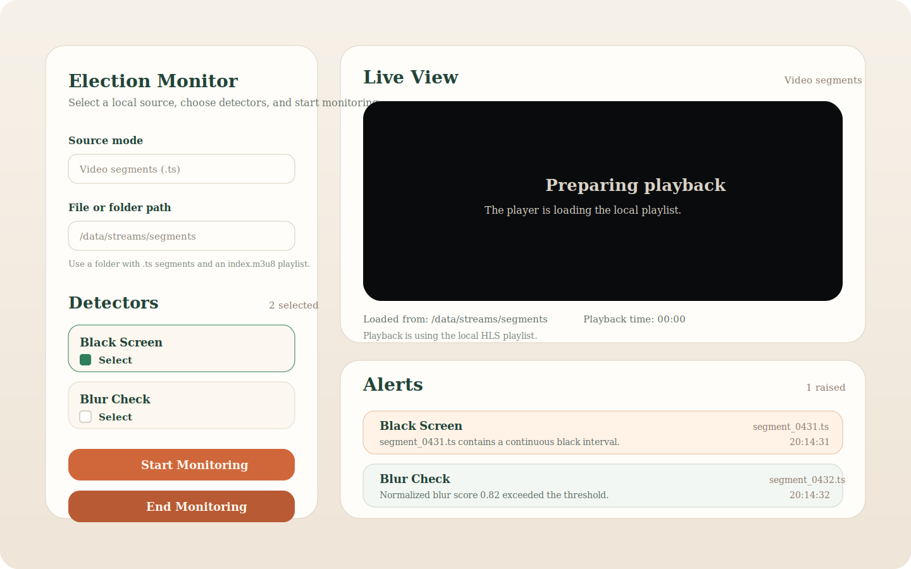
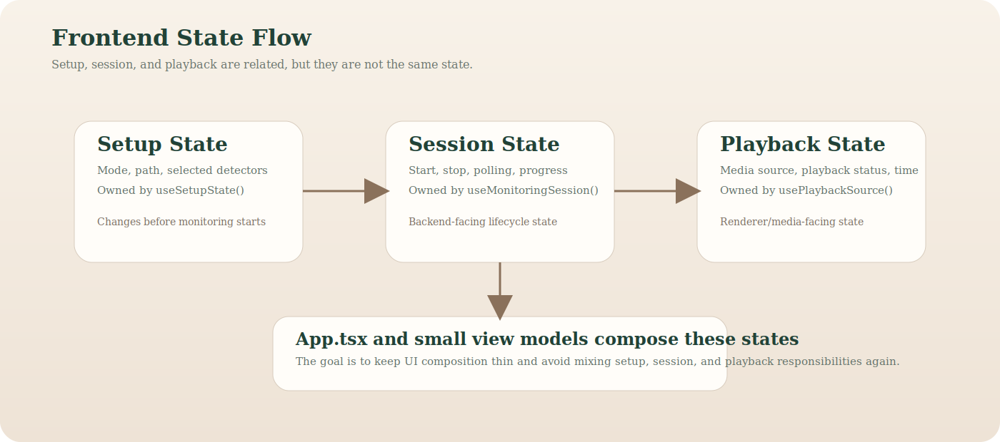

# Frontend Architecture

This document explains the current frontend shape and how it talks to the
backend.

It is aimed at contributors and coding agents working on the React/Electron
side of the project.

## At a glance

- React owns UI composition and local state transitions
- Electron owns the privileged bridge and playback-safe local media protocol
- Python remains the source of truth for monitoring sessions and playback
  source resolution
- playback state is separate from monitoring session state on purpose

## Current frontend idea

The frontend is local-first.

It is built around:

- React for UI
- Electron for the desktop shell and local bridge
- the Python backend for detector logic, session state, and playback resolution

The frontend is no longer just a demo shell. It now follows a clearer split between setup, session, and playback state.

The backend-facing surface is also stricter now:

- one explicit preload bridge surface
- explicit success/error transport envelopes
- one normalized frontend bridge contract consumed by hooks
- local HLS proxying for remote HLS playback that would otherwise fail in the
  renderer

## Main frontend layers

### 1. Setup state

Owned mainly through:

- [`frontend/src/hooks/useSetupState.ts`](../frontend/src/hooks/useSetupState.ts)

This layer owns:

- source mode
- source path
- selected detectors
- visible detectors for the chosen mode

### 2. Monitoring session state

Owned mainly through:

- [`frontend/src/hooks/useMonitoringSession.ts`](../frontend/src/hooks/useMonitoringSession.ts)

This layer owns:

- start monitoring
- stop monitoring
- polling session snapshots
- session status
- session errors
- typed bridge error handling after transport normalization

### 3. Playback state

Owned mainly through:

- [`frontend/src/hooks/usePlaybackSource.ts`](../frontend/src/hooks/usePlaybackSource.ts)

This layer owns:

- playback source resolution
- playback status
- playback time
- playback errors
- live-vs-file playback assumptions derived from the resolved source
- HLS vs direct-file playback behavior after resolution

That split is important because backend session state and media playback state are related, but they are not the same thing.

## Main UI file

- [`frontend/src/App.tsx`](../frontend/src/App.tsx)

`App.tsx` is now mostly composition:

- setup controls
- session status panel
- playback panel
- alert feed

The heavy state logic was moved into hooks and small view-model helpers.

## Electron bridge

Main backend bridge files:

- [`frontend/electron/main.mjs`](../frontend/electron/main.mjs)
- [`frontend/electron/preload.mjs`](../frontend/electron/preload.mjs)
- [`frontend/src/bridge/contract.ts`](../frontend/src/bridge/contract.ts)
- [`frontend/src/bridge/transport.ts`](../frontend/src/bridge/transport.ts)

Current responsibilities are split like this:

- `preload.mjs`
  - exposes one minimal `window.electionBridge` surface
- `main.mjs`
  - stays mostly as Electron bootstrap and wiring
  - delegates IPC bridge registration plus app/protocol lifecycle hooks
  - delegates FastAPI startup/readiness and media/proxy details to focused helpers
- `fastApiStartupOrchestrator.mjs`
  - composes startup, readiness polling, and shutdown around the FastAPI runtime
- `fastApiProcessManager.mjs`
  - owns process spawn/stop and single-owner runtime behavior
- `fastApiRuntimePolicy.mjs`
  - owns readiness timeout and unavailable-runtime policy
- `fastApiFallback.mjs`
  - preserves the narrower fallback seam for unavailable-runtime behavior
- `bridgeHandlerRegistry.mjs`
  - owns the current IPC channel map and shared runtime-policy wrapper for bridge handlers
- `bridgeResponses.mjs`
  - owns success/error envelope mapping for Electron bridge handlers
- `fastApiClient.mjs`
  - owns the thin JSON client for FastAPI-backed bridge calls
- `playbackSourcePolicy.mjs`
  - adapts validated playback sources into renderer-safe URLs
- `localMediaRequestPolicy.mjs`
  - classifies `local-media://` requests before response generation
- `localMediaResponses.mjs`
  - owns concrete local-media file serving and remote HLS proxy responses
  - keeps protocol response behavior separate from protocol request classification
- `contract.ts`
  - stable public bridge-normalization facade
  - delegates error, detector, and session-snapshot normalization to focused helpers
- `contractErrors.ts`
  - owns bridge error codes/payloads, typed transport errors, and success/failure envelopes
- `contractDetectors.ts`
  - owns detector-catalog normalization
- `contractSessionSnapshot.ts`
  - owns session summary/progress/snapshot normalization
- `contractShared.ts`
  - owns the small shared validators used by the bridge normalizers
- `transport.ts`
  - selects the active transport implementation and falls back to demo mode when needed
- `index.ts`
  - creates the normalized singleton bridge used by hooks and app code

The bridge currently handles:

- listing detectors
- starting a session
- reading a session snapshot
- cancelling a session
- resolving playback sources
- serving local media to the renderer
- proxying remote HLS playlists and assets through `local-media://`

This is the layer that keeps the React frontend from needing to know Python process details directly.

Useful focused tests for this split now include:

- `frontend/src/bridge/contract.success.test.ts`
- `frontend/src/bridge/contract.errors.test.ts`
- `frontend/src/bridge/contract.session-snapshot.test.ts`
- `frontend/src/bridge/transport.test.ts`
- `frontend/src/hooks/useMonitoringSession.lifecycle.test.tsx`
- `frontend/src/hooks/useMonitoringSession.apiStream.test.tsx`
- `frontend/src/hooks/usePlaybackSource.test.tsx`
- `frontend/src/uiErrors.test.ts`
- `frontend/electron/bridgeResponses.test.mjs`
- `frontend/electron/bridgeHandlerRegistry.test.mjs`
- `frontend/electron/fastApiClient.test.mjs`
- `frontend/electron/fastApiFallback.test.mjs`
- `frontend/electron/fastApiProcessManager.test.mjs`
- `frontend/electron/fastApiRuntimePolicy.test.mjs`
- `frontend/electron/fastApiStartupOrchestrator.test.mjs`
- `frontend/electron/playbackSourcePolicy.test.mjs`
- `frontend/electron/localMediaResponses.test.mjs`
- `frontend/electron/localMediaRequestPolicy.test.mjs`
- `frontend/electron/hlsProxy.test.mjs`

The bridge error payload can now preserve backend-native metadata when
available:

- `backend_error_code`
- `status_reason`
- `status_detail`

UI code may still present a simplified operator-facing message, but the bridge
contract now has room to preserve backend meaning during the FastAPI migration.

## Current design goals

The frontend is optimized for:

- local development speed
- understandable state flow
- stable playback for local files and segments
- stable playback for remote HLS sources that require Electron-side proxying
- future source growth without rewriting everything
- transport replaceability without changing UI semantics

That is why the frontend now prefers:

- small hooks
- normalized state
- simple control rules
- presentation-focused components

## Current UX model

The main user flow is:

1. choose source mode
2. choose file or folder path
3. choose detectors
4. start monitoring
5. watch playback
6. inspect alerts
7. end monitoring

That flow should stay simple even if more detectors or API streams are added later.

## Future direction

Most likely frontend next steps:

- keep detector UX simple as more detectors are added
- show better error and session diagnostics
- keep hardening `api_stream` as another source type
- avoid coupling frontend logic too tightly to one backend transport

## Notes For Agents

- Keep business rules out of React components when they can live in hooks or
  presenters.
- Treat `bridge/contract.ts`, `contractErrors.ts`, `transport.ts`, and `types.ts`
  as the main frontend contract boundary, with `contract.ts` remaining the public
  normalization entrypoint.
- If you change remote playback behavior, check:
  - `frontend/electron/main.mjs`
  - `frontend/electron/hlsProxy.mjs`
  - `frontend/src/hooks/usePlaybackSource.ts`
  - `frontend/src/components/VideoPlayerPanel.tsx`
